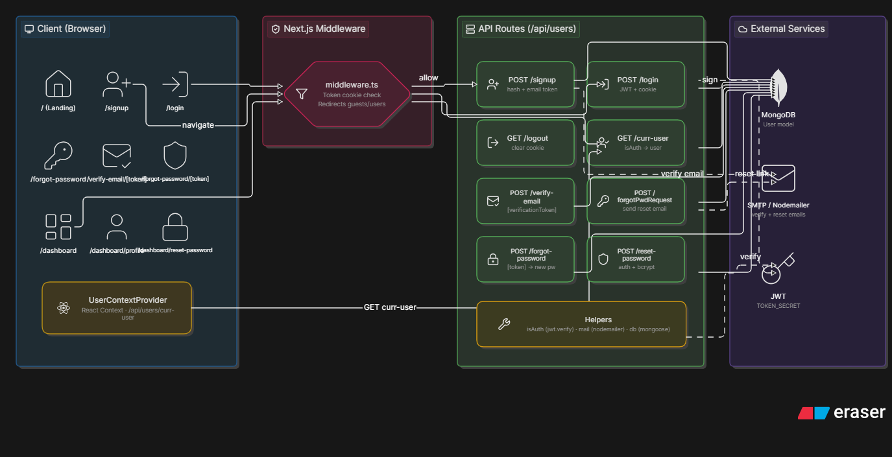

# Full-Stack Authentication System (Next.js & MERN)

A robust, secure, and production-ready authentication and user management system built using Next.js, Node.js, and MongoDB. This project implements secure cookie-based session tracking, edge-level route protection, and fully integrated transactional email workflows.

## 📐 Architecture Overview

Below is the architectural blueprint of the application, tracking the lifecycle of a request from the client browser to the database:



### Key Architectural Pillars:
1. **Edge-Level Middleware:** Uses Next.js `middleware.ts` to intercept and validate session cookies before pages render, preventing unauthorized layout shifts and handling guest/user redirects.
2. **React Context State:** Global user state is managed via a `UserContext` provider that auto-hydrates on application boot by fetching user session details from `/api/users/curr-user`.
3. **Secure API Backend:** Modular API endpoints handle user lifecycle operations using JWTs for stateless security and `bcrypt` for secure password hashing.
4. **Transactional Mailers:** Integrated SMTP pipelines using Nodemailer for tokenized email verification and password recovery routes.

---

## 🛠️ Tech Stack

- **Frontend & Routing:** Next.js, React (Context API), Tailwind CSS
- **Backend & Middleware:** Node.js, Next.js Middleware, Express-style API routing
- **Database:** MongoDB & Mongoose
- **Security:** JSON Web Tokens (JWT), HTTP-Only Cookies, Bcrypt
- **Email Service:** Nodemailer (SMTP Integration)

---

## 🔑 API Endpoints & Features

| Method | Endpoint | Description | Protected |
| :--- | :--- | :--- | :--- |
| `POST` | `/api/users/signup` | Registers a new user, hashes password, generates email verification token. | No |
| `POST` | `/api/users/login` | Authenticates user credentials, signs JWT, and sets an HTTP-Only cookie. | No |
| `GET` | `/api/users/logout` | Clears the session cookie to securely log the user out. | No |
| `GET` | `/api/users/curr-user` | Validates JWT token and returns current user details to hydrate UI state. | Yes |
| `POST` | `/api/users/verify-email` | Consumes `[verificationToken]` to activate the user account. | No |
| `POST` | `/api/users/forgotPwdRequest` | Initiates a password reset flow and dispatches a dynamic reset link email. | No |
| `POST` | `/api/users/forgot-password` | Validates the recovery token and updates the database with the new password. | No |
| `POST` | `/api/users/reset-password` | Allows authenticated users to update their current password. | Yes |

---

## 🚀 Getting Started

### Prerequisites
- Node.js (v18+ recommended)
- MongoDB Instance (Local or Atlas)
- SMTP Server details (e.g., Mailtrap, SendGrid, Gmail)

### Environment Variables
Create a `.env.local` file in the root directory and configure the following keys:

```env
# Database
MONGODB_URI=your_mongodb_connection_string

# Security
TOKEN_SECRET=your_jwt_secret_key

# SMTP Configuration
SMTP_HOST=your_smtp_host
SMTP_PORT=your_smtp_port
SMTP_USER=your_smtp_username
SMTP_PASS=your_smtp_password
